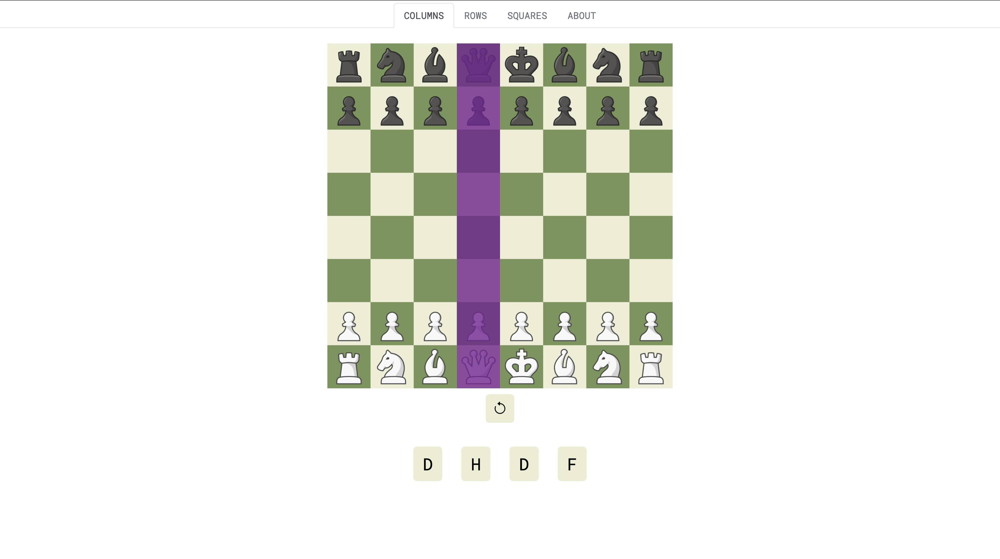

# Master the Chessboard

[Master the Chessboard](https://fernando-lozano.github.io/chessboardNotation/) helps you to memorize the chessboard notation by focusing on learning the rows and columns individually before practicing each individual square.

## Usage

